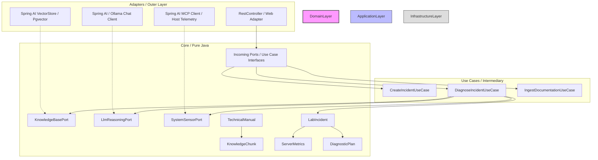
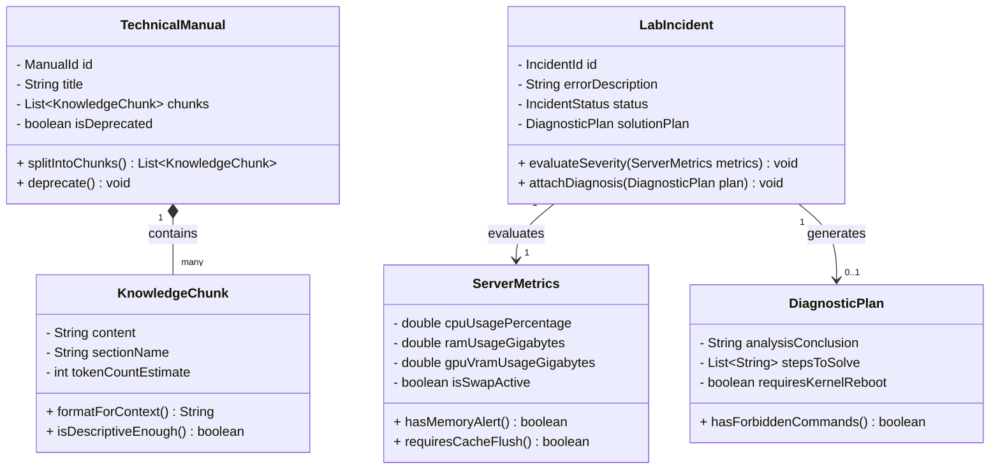

# LabMetricsIA - DevOps Intelligence Assistant

`LabMetricsIA` is a software architecture laboratory designed to assist developers and DevOps engineers in managing system incidents, consulting technical documentation, and monitoring server health.

This application is built using **Hexagonal Architecture (Ports and Adapters)**, ensuring a rich, non-anemic domain completely decoupled from external frameworks, databases, and Artificial Intelligence (AI) dependencies.

---

## 🛠️ Tech Stack & Hardware Context

### Hardware Specs (Target Lab Environment)

- **OS:** Ubuntu 26.04.1 LTS (Resolute Raccoon) x86_64
- **CPU:** AMD Ryzen 7 255 (16 cores) @ 4.97 GHz
- **GPU:** AMD Radeon 780M Graphics (Integrated RDNA3)
- **Memory:** 45.83 GiB System RAM (18GB shared via BIOS for UMD graphics)

### Software & AI Stack

- **Language:** Java 21+ (Pure Domain, Object-Oriented)
- **Framework:** Spring Boot 3.4+ (Infrastructure only)
- **AI Integration:** Spring AI (Ollama Local Client / Remote API Adapter)
- **Context Management:** Model Context Protocol (MCP) for Ubuntu telemetry
- **Vector Database:** PostgreSQL with `pgvector` / Qdrant (Dockerized)

---

## 📐 Architecture Overview

The system isolates its core business logic from outer infrastructure layers. Spring AI, Ollama, Vector Databases, and REST Controllers act purely as **Adapters** implementing **Ports** defined by the Domain.



---

## 🧠 Domain Model (Step 1 - Current Focus)

The domain is driven by **5 core classes/objects** written in pure Java (No Spring, No JPA annotations).



### Domain Business Rules (Rich Logic Constraints)

1. **`TechnicalManual`**: Cannot be processed if it is marked as deprecated or its title is empty.
2. **`KnowledgeChunk`**: Must evaluate if its character/token size meets minimum data density before being stored in the Vector Database.
3. **`ServerMetrics`**: Evaluates hardware stress levels. If RAM utilization crosses 90%, it flags a critical system state.
4. **`LabIncident`**: When evaluating server metrics, if a memory alert is active, it automatically sets the incident severity to `CRITICAL`, overriding regular priorities.
5. **`DiagnosticPlan`**: Validates the suggested instructions against an internal blacklist of hazardous system commands (e.g., destructive operations on root directories) to preserve laboratory safety.

## 📁 Repository Directory Structure

```text
labmetricsia
├── devopsmind/         # Main Spring Boot Application (Hexagonal Architecture Inside)
├── mcps/               # Complementary MCP Servers & Tooling
├── infrastructure/     # Manifests & Deployment Configurations (Docker-Compose, K8s)
├── http/               # Functional API Testing (*.http files for request validation)
├── performance/        # Performance & Stress Testing Projects (JMeter, Gatling, etc.)
└── README.md           # Project Documentation & Single Source of Truth
```

---

## 🚀 Roadmap

- [x] **Step 0:** Architecture Conception & Domain Context Design
- [ ] **Step 1:** Pure Java Rich Domain Implementation (No Frameworks)
- [ ] **Step 2:** Application Layer & Port Definitions (Use Cases)
- [ ] **Step 3:** Infrastructure Setup (Dockerized pgvector & Local Ollama)
- [ ] **Step 4:** Spring AI Integration (Vector Store & Chat Client Adapters)
- [ ] **Step 5:** Model Context Protocol (MCP) Telemetry Adapter
