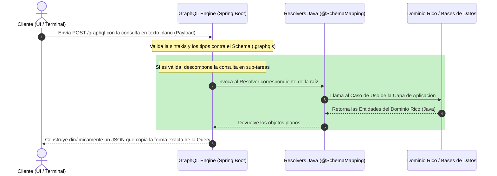

# 🚥 Arquitectura de Interfaces: Guía Técnica de GraphQL

Este documento detalla los fundamentos arquitectónicos, el flujo de ejecución y las directrices técnicas del uso de **GraphQL** como la interfaz de entrada unificada para la plataforma **LabMetricsIA**.

---

## 1. ¿Qué es GraphQL y cuál es su Historia?

**GraphQL** es un lenguaje de consultas para APIs (_Query Language_) y un entorno de ejecución (_runtime_) del lado del servidor diseñado para responder a dichas consultas utilizando un sistema de tipos estrictos.

A diferencia de las arquitecturas REST tradicionales, que exponen múltiples URLs fijas (endpoints) asociadas a recursos rígidos, GraphQL expone **un único endpoint HTTP universal (usualmente `/graphql`)** que actúa como una compuerta inteligente a la que el cliente le envía un manifiesto declarativo indicando con precisión quirúrgica qué campos necesita recibir.

### 📜 Breve Historia

- **El Origen (2012):** Desarrollado internamente por **Facebook** cuando su equipo de ingeniería se topó con un cuello de botella técnico al migrar sus aplicaciones móviles nativas. Las APIs REST consumían excesiva batería y datos debido a las decenas de peticiones HTTP consecutivas en cascada requeridas para renderizar una sola pantalla (buscar el usuario, sus posts, sus comentarios, sus likes).
- **El Open Source (2015):** Tras probar su estabilidad y rendimiento a escala masiva, Facebook liberó la especificación como código abierto.
- **La Gobernanza (2018):** Para garantizar su neutralidad e independencia, la propiedad intelectual se transfirió a la **GraphQL Foundation**, una entidad sin fines de lucro bajo la tutela de la _Linux Foundation_ que hoy gobierna su evolución.

---

## 2. Problemas del Modelo Tradicional que Resuelve

GraphQL fue diseñado específicamente para erradicar los tres dolores de cabeza más grandes en el desarrollo de APIs modernas:

### A. Over-fetching (Sobrecarga de Datos)

Ocurre cuando un endpoint devuelve un JSON gigante lleno de propiedades que el cliente no necesita en una pantalla específica.

- _Contexto LabMetricsIA:_ Si la terminal solo requiere pintar el título de un manual y su estado de depreciación, una API REST común devolvería el JSON completo con las rutas físicas del archivo, el peso en bytes, el autor y la lista completa de miles de `KnowledgeChunks`. GraphQL elimina este desperdicio permitiendo al cliente solicitar únicamente `title` e `isDeprecated`.

### B. Under-fetching (Escasez de Datos) y el Problema N+1

Ocurre cuando un endpoint devuelve tan poca información que el cliente se ve obligado a realizar múltiples peticiones HTTP consecutivas para armar una sola interfaz.

- _Contexto LabMetricsIA:_ Buscar un incidente (`/incidents/1`), luego sus métricas (`/incidents/1/metrics`) y luego su plan de diagnóstico (`/incidents/1/plan`). GraphQL resuelve esto permitiendo anidar las relaciones en una única consulta atómica y estructurada.

### C. Versionamiento de APIs

En REST, cuando el modelo de datos cambia, los equipos se ven obligados a mantener rutas paralelas como `/api/v1/manuals` y `/api/v2/manuals`. En GraphQL, la API **no se versiona**. Los campos antiguos obsoletos simplemente se marcan con la directiva `@deprecated` y se añaden campos nuevos al esquema. Las aplicaciones de distintas versiones conviven interactuando con el mismo endpoint sin romperse.

---

## 3. Principio de Funcionamiento

GraphQL opera bajo un manifiesto estricto llamado **Esquema (Schema)** escrito en **SDL** (_Schema Definition Language_). Este esquema es un contrato tipado inmutable que define qué consultas se pueden realizar (`Query`), qué modificaciones de datos se permiten (`Mutation`) y qué flujos en tiempo real se exponen (`Subscription`).

### 🗺️ El Flujo de Ejecución Semántico

---

## 4. Ventajas y Desventajas Arquitectónicas

### ✅ Ventajas

- **Eficiencia en Red:** Reduce drásticamente el uso de ancho de banda y la latencia al consolidar las consultas en una única petición adaptada al consumidor.
- **Autodocumentado (Introspección):** Expone una capacidad nativa llamada _Introspection_. Herramientas interactivas como **GraphiQL** pueden leer el servidor y generar de forma automática la documentación de las consultas, tipos y campos disponibles en tiempo real.
- **Tipado Estricto en la Frontera:** Si un cliente intenta enviar un texto en un campo definido como `Float` o `Boolean`, el motor rechaza la petición en la frontera antes de sobrecargar la lógica de negocio.

### ❌ Desventajas

- **Complejidad en el Caché HTTP:** Al ser todas las peticiones de tipo `POST` hacia la misma URL, no se puede cachear una URL completa de forma nativa en la red (`GET /api/manuals/1`). El caché debe gestionarse en el cliente o mediante herramientas a nivel de grafo de objetos (ej: _Apollo/Relay Cache_).
- **Peligro de Consultas Abusivas (DoS Semántico):** Dado que el cliente tiene la libertad de armar la consulta con la profundidad que desee, un usuario malintencionado podría enviar una consulta con anidaciones infinitas (ej: _Manual que contiene Chunks, que apuntan al Manual, que contiene Chunks..._), ralentizando la CPU al procesar los resolvers en bucle.
- **Curva de Aprendizaje:** Requiere que el equipo de desarrollo asimile el concepto de _Resolvers_ y el diseño de esquemas estructurados en lugar del mapeo tradicional de controladores HTTP.

---

## 5. Tabla Comparativa Directa: REST vs GraphQL

| Característica                  | Arquitectura RESTful                                         | Arquitectura GraphQL                                                  |
| :------------------------------ | :----------------------------------------------------------- | :-------------------------------------------------------------------- |
| **Punto de Acceso (Endpoints)** | Múltiples URLs estructuradas (`/manuals`, `/incidents`).     | **Un único endpoint** universal (normalmente `/graphql`).             |
| **Operaciones**                 | Verbos HTTP estandarizados (`GET`, `POST`, `PUT`, `DELETE`). | Operaciones explícitas del SDL (`Query`, `Mutation`, `Subscription`). |
| **Forma de la Respuesta**       | Determinada rígidamente por el **Servidor**.                 | Determinada de forma dinámica por el **Cliente**.                     |
| **Volumen de Datos**            | Propenso a _Over-fetching_ y _Under-fetching_.               | **Precisión quirúrgica**. Cero bytes desperdiciados.                  |
| **Versionamiento**              | Rígido, basado en rutas o cabeceras (`/v1/`, `/v2/`).        | Evolución continua sin versiones. Campos `@deprecated`.               |
| **Manejo del Caché**            | Nativo e inmediato a nivel de red y proxies HTTP (fácil).    | Complejo. Requiere caché a nivel de grafo/entidad (difícil).          |
| **Documentación**               | Externa (requiere herramientas como _Swagger / OpenAPI_).    | **Nativa e integrada** mediante introspección en tiempo real.         |
