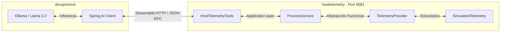
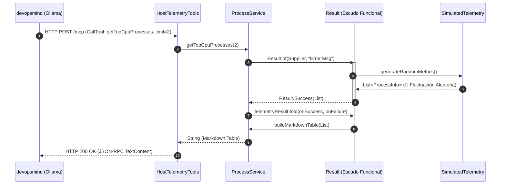
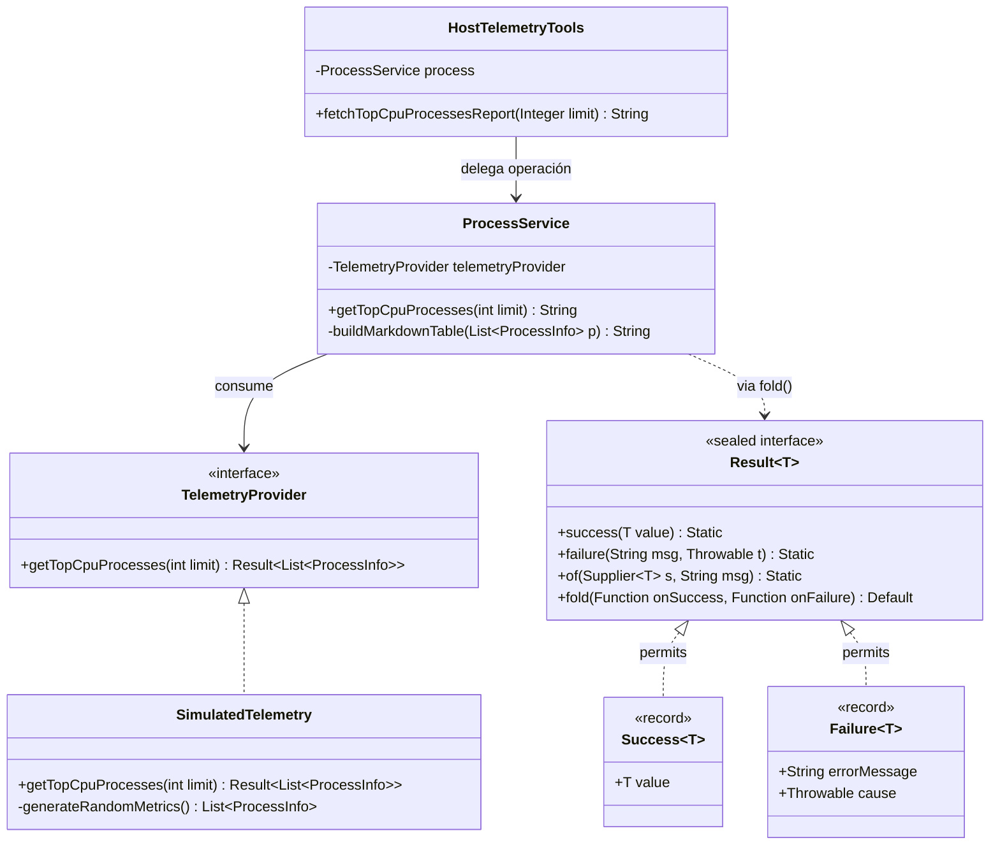

# 📊 Host Telemetry - Servidor MCP

Este subproyecto del monorrepo actúa como un **Servidor MCP (Model Context Protocol)** legítimo e independiente, diseñado bajo las especificaciones oficiales de Anthropic y **Spring AI (mcp-core-2.0.0.jar)** utilizando **Java 25**.

Su misión principal es actuar como un agente de infraestructura periférico, exponiendo herramientas tácticas de SRE hacia el orquestador cognitivo principal (`devopsmind`) a través del transporte de alto rendimiento **Streamable-HTTP**.

---

## 🛠️ Especificación de la Herramienta MCP (Tools)

El servidor expone de forma declarativa e interactiva el siguiente comando unificado hacia la red local:

### 📦 `getTopCpuProcesses`

- **Descripción:** Recupera en tiempo real y con fluctuaciones dinámicas aleatorias los procesos que más CPU consumen en el host actual.
- **Tipo de Transporte:** `STREAMABLE` (Streamable-HTTP) libre de los bloqueos tradicionales de SSE.
- **Esquema de Entrada (JSON-RPC Schema):**
  ```json
  {
    "type": "object",
    "properties": {
      "limit": {
        "type": "integer",
        "description": "Cantidad máxima de procesos SRE a retornar en la tabla (por defecto es 3)"
      }
    }
  }
  ```
- **Payload de Salida:** Una tabla estructurada en formato **Markdown puro** que el LLM (Ollama / Llama 3.2) digiere de forma nativa para formular sus planes de mitigación.

---

## 🏗️ Diagramas Arquitectónicos (Mermaid)

### 🧩 1. Diagrama de Componentes del Ecosistema MCP

Muestra cómo se desacoplan el cliente cognitivo y el servidor de infraestructura sobre la red local de tu Ryzen 7.



### ⏱️ 2. Diagrama de Secuencia E2E (Flujo Cognitivo SRE)

Detalla el ciclo de vida de un zarpazo de red desde que ingresa la alerta hasta que el patrón `Result` devuelve la tabla Markdown.



### 🧱 3. Diagrama de Clases y Fronteras Selladas

Ilustra el diseño modular y el uso de las palabras reservadas **`sealed`** y **`permits`** de Java 25 para garantizar Pattern Matching exhaustivo.



---

## 👑 El Patrón Functional `Result<T>` Bajo la Lupa

Para erradicar por completo el control de flujo basado en bloques `try-catch` explícitos y rústicos, el dominio implementa una **interfaz sellada de Java 25**:

- **`sealed interface Result<T> permits Success, Failure`**: Bloquea inmutablemente la jerarquía en la memoria RAM, impidiendo extensiones rebeldes y forzando al compilador a validar la exhaustividad de los flujos.
- **`Result.of(Supplier<T>)`**: Actúa como un contenedor biológico. Absorbe la ejecución de la lambda de métricas aleatorias; si todo sale bien, fabrica un `Success`, y si el hilo colapsa, lo convierte en un valor legítimo de retorno `Failure`.
- **`fold(Function, Function)`**: Utiliza el **Pattern Matching** de Java 25 para desvanecer el objeto de forma segura en un único tipo final (`String`).

```java
// Ejemplo real en el ProcessService utilizando Type Witness explícito:
return telemetryResult.<String>fold(
    processes -> buildMarkdownTable(processes),
    failure -> String.format("### ❌ FALLO DE TELEMETRÍA\n%s", failure.errorMessage())
);
```

---

## 🚀 Guía de Ejecución y Pruebas Especializadas

### 🧪 1. Pruebas Unitarias Solitarias (Pureza con Mockito)

Garantizan el aislamiento de las capas de negocio y de red bloqueando la aleatoriedad mediante `@Mock`.

```bash
mvn clean test
```

### 🧪 2. Pruebas de Integración E2E Polimórficas (Failsafe)

Utilizan el componente maestro **`McpTestClientProvider`** para negociar el canal JSON-RPC levantando un servidor Tomcat efímero en un puerto aleatorio, permitiendo conmutar el protocolo en el archivo `application-itest.yaml`.

```bash
mvn verify -Pintegration-tests
```

### 🏃 3. Encender el Servidor en Producción Local

Arranca la aplicación como un microservicio autónomo de Streamable-HTTP escuchando en el puerto `8081`.

```bash
mvn spring-boot:run
```
